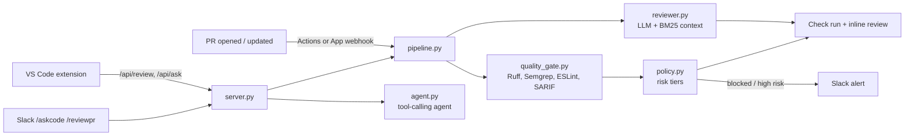

# Agentic Ops

AI developer tooling in one Python service and CLI:

| Capability | What it does | Where it runs |
| --- | --- | --- |
| **Automated PR reviewer** | LLM review of the diff with repo context; schema-validated inline comments anchored only to added lines | GitHub Actions, GitHub App webhook, Slack `/reviewpr`, VS Code |
| **Code-quality gate** | Ruff, Semgrep (custom rules), ESLint, CodeQL/SonarQube SARIF, SonarQube quality gate, all run through a risk-based `policy.yml` | Check run on every PR, `agentic-ops gate` locally |
| **Test generation** | Finds untested functions (coverage.py JSON), writes pytest tests, runs them, repairs once, keeps only passing tests | CLI, weekly workflow that opens a PR |
| **Codebase-aware agent** | Tool-calling agent (search / read / list) over a symbol-aware BM25 index | CLI, Slack `/askcode` + @mentions, VS Code "Ask the Codebase" |
| **Evals** | Golden PRs with known bugs, precision/recall, regression gate in CI | `agentic-ops eval` |
| **Metrics** | PR cycle time, time to first review, review load, PR size, bot 👍/👎 acceptance | `agentic-ops metrics` |

LLM calls go through one interface (`agentic_ops/llm.py`). Claude is the default, and you switch to OpenAI with `LLM_PROVIDER=openai`.

## Quick start

```bash
./scripts/bootstrap.sh                       # venv, deps, scanners, tests, index, .env
source .venv/bin/activate
# put ANTHROPIC_API_KEY in .env, then:
agentic-ops review --base origin/main        # gate + AI review of your current branch
agentic-ops ask "how are webhooks authenticated?" -v
agentic-ops testgen src/pkg/module.py --coverage coverage.json
agentic-ops eval --min-precision 0.6 --min-recall 0.6
agentic-ops metrics --repo org/repo --days 30
agentic-ops serve                            # webhook + IDE API + Slack on :8080
```

## Architecture



Design choices worth knowing:

- **Deterministic first, LLM second.** Scanners run before the model, and their findings go into the prompt, so the model doesn't repeat them.
- **Precision over recall.** The prompt asks for zero comments rather than speculative ones. Comments not on added lines are dropped or snapped to within 3 lines, and results are deduplicated and capped by severity.
- **Prompt-injection hygiene.** The diff and file contents are treated as untrusted data. There's also a custom Semgrep rule that flags system prompts built from f-strings.
- **Risk-based policy.** `high` paths (auth, crypto, workflows, migrations) block on warnings and require a human. `low` paths (docs) can be auto-approved, but only if `AGENTIC_OPS_ALLOW_AUTO_APPROVE=true`.
- **Test generation never lands failing tests.** Generated tests must pass against the current code, and suspected bugs are reported in `notes` instead.

## Integrations

### CI/CD (fastest path)
Copy `.github/workflows/`, `policy.yml` and `semgrep/` into the target repo and add the `ANTHROPIC_API_KEY` secret.
- `agentic-ops.yml`: CodeQL → gate + AI review (check run, inline comments, step summary). An eval job runs when the `run-evals` label is set.
- `testgen.yml`: runs weekly or on demand, generates tests for the 3 lowest-coverage files and opens a PR.
- Edit the CodeQL `languages:` line to match your repo.

### Git: GitHub App (org-wide, no per-repo workflow)
1. Create an app from `deploy/github-app-manifest.json`: pull requests (write), checks (write), contents (read), and the `pull_request` event.
2. Save the private key as `github-app.pem`, then set `GITHUB_APP_ID` and `GITHUB_WEBHOOK_SECRET` in `.env`.
3. Run `docker compose up --build` (or `kubectl apply -f deploy/k8s.yaml`) and point the webhook at `https://<host>/github/webhook`.

### Slack
Create a Slack app with the slash commands `/askcode` and `/reviewpr`, plus the `app_mention` event. Point all of them at `https://<host>/slack/events`. It needs the `commands`, `chat:write` and `app_mentions:read` scopes. Set `SLACK_BOT_TOKEN`, `SLACK_SIGNING_SECRET` and, optionally, `SLACK_NOTIFY_CHANNEL` to get alerts for blocked or high-risk PRs.

### IDE (VS Code)
Build with `./scripts/bootstrap.sh --with-vscode` and install the `.vsix`. Then set `agenticOps.serverUrl` and `agenticOps.apiToken` (the `AGENTIC_OPS_API_TOKEN` value from `.env`). The extension adds four commands: Review Current File, Review Uncommitted Changes, Ask the Codebase, and Clear Findings. You can optionally turn on review-on-save.

### SonarQube (optional)
Set `SONAR_HOST_URL`, `SONAR_TOKEN` and `SONAR_PROJECT_KEY`, and the gate will fail when the Sonar quality gate fails. For a local instance, run `docker compose --profile sonar up`.

## Layout

```
agentic_ops/
  llm.py            provider-neutral client, tool calling, structured output + repair retry
  diff.py           unified-diff parser with new-file line numbers
  quality_gate.py   scanner runners/parsers, SARIF in/out, SonarQube
  policy.py         risk tiers, ** globs, block / human-review / auto-approve decisions
  reviewer.py       prompt, context retrieval, post-processing, GitHub formatting
  indexer.py        AST-aware chunking + BM25 (swap for embeddings at scale)
  agent.py          tool-calling codebase agent with path-traversal guard
  testgen.py        untested-function discovery, generate → run → repair → keep
  evals.py          golden-set precision/recall
  metrics.py        cycle time, review latency/load, bot acceptance
  github_client.py  App JWT auth, reviews (422 fallback), check runs, PR checkout
  server.py         FastAPI: /github/webhook, /api/review, /api/ask, /slack/events
  slack_app.py      Slack Bolt commands and mentions
  cli.py            `agentic-ops` entry point
evals/golden/       golden PR cases (add your own real misses here)
semgrep/rules.yml   custom rules incl. LLM prompt-injection and credential checks
vscode-extension/   TypeScript extension
```

## Extending

- **Evals:** add a JSON file to `evals/golden/` each time the reviewer misses a bug or leaves a noisy comment. This is how precision stays measurable over time.
- **Embeddings:** replace `CodeIndex.search` with a vector store once a repo has more than about 50k chunks.
- **GitLab:** add a `gitlab_client.py` with the same four methods (diff, review notes, commit status, checkout).
